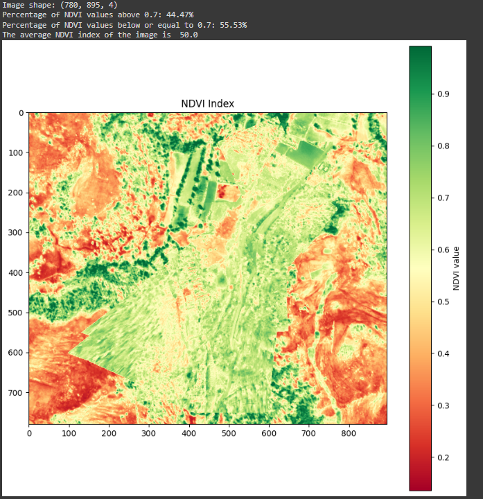

# NDVI Analysis Using Drone Imagery

## Overview
This project computes the NDVI (Normalized Difference Vegetation Index)
from stitched drone imagery and estimates green vs barren land coverage.

## Workflow
1. Drone images stitched using Pix4D / QGIS
2. Orthomosaic converted to TIFF
3. NDVI computed using Python
4. Vegetation threshold analysis performed

## Folder Structure
- `src/` → Python scripts
- `results/` → NDVI outputs
- `processed_image/`→ final stitched image

## Sample Output

